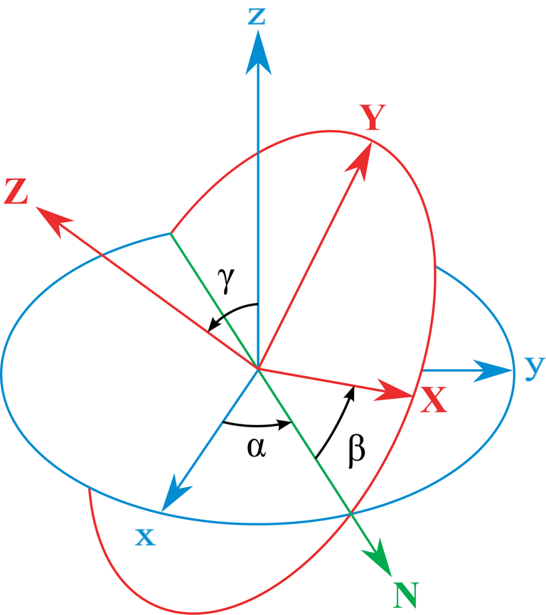

# Rotation matrix {docsify-ignore}

Any 3 dimensional coordinate system (including conventional Cartesian axes x, y and z) can be rotated to another 3 dimensional coordinate system as long as they maintain the orthogonality among the axes. In linear algebra, this is called change of basis. 

Thus any properties described by a vector in 3 dimensional axes could be rotated in a new set of axes too with the equation below.

$$ \hat{\mathbf{u}} = \mathbf{R}^{-1} \mathbf{u} $$

where $\hat{\mathbf{u}}$ is property vector (such as velocity and acceleration) in a rotated 3 dimensional coordinate system, $\mathbf{R}$ is rotation matrix, and $\mathbf{u}$ is property vector in original 3 dimensional coordinate system.

The rotation angle convention is shown in figure below. 

The lower case x, y, z is the original coordinate system, while the upper case X, Y, Z is the rotated coordinate system. The angles shown are defined anti-clockwise from the original coordinate system. Note that all angles in the code are in radians, not degrees. Also $\symbol{gamma} = 0$ in 2 dimensional case and the implementation omits this extra variable. 

The rotation matrix, $\mathbf{R}$ is defined as follow

$$
\mathbf{R} = \left[
\begin{matrix}
\cos{\alpha} \cos{\beta} - \sin{\alpha} \cos{\gamma} \sin{\beta} & 
- \cos{\alpha} \sin{\beta} - \sin{\alpha} \cos{\gamma} \cos{\beta} &
\sin{\gamma} \sin{\alpha} \\\\
\sin{\alpha} \cos{\beta} + \cos{\alpha} \cos{\gamma} \sin{\beta} & 
- \sin{\alpha} \sin{\beta} + \cos{\alpha} \cos{\gamma} \cos{\beta} &
- \sin{\gamma} \cos{\alpha} \\\\
\sin{\gamma} \sin{\beta} & 
\sin{\gamma} \cos{\beta} &
\cos{\gamma} 
\end{matrix}
\right]
$$

In 2 dimensional, the rotation matrix is simplified as follow

$$
\mathbf{R} = \left[
\begin{matrix}
\cos{\alpha} \cos{\beta} - \sin{\alpha} \sin{\beta} & 
- \cos{\alpha} \sin{\beta} - \sin{\alpha} \cos{\beta} \\\\
\sin{\alpha} \cos{\beta} + \cos{\alpha} \sin{\beta} & 
- \sin{\alpha} \sin{\beta} + \cos{\alpha} \cos{\beta} \
\end{matrix}
\right]
$$

