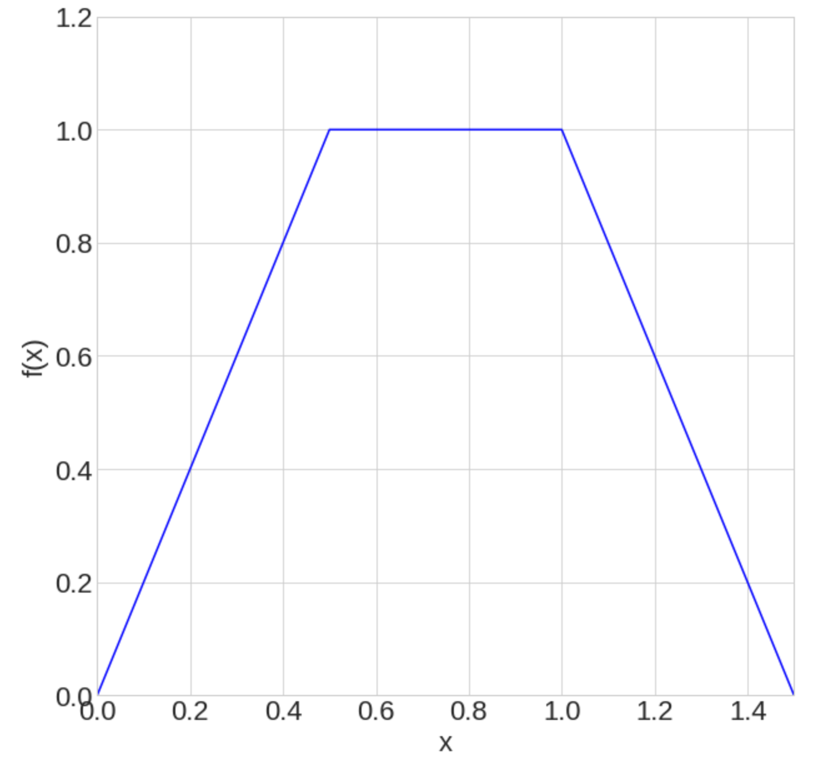

# Preprocessing

## Input JSON
The CB-Geo MPM code uses a `JSON` file for input configuration.

```JSON
{
  "title": "Example JSON Input for 3D MPM",
  "input_files": {
    "mesh": "mesh-3d.txt",
    "particles": "particles-3d.txt",
    "velocity_constraints": "velocity-constraints.txt",
    "nodal_tractions": "nodal-tractions.txt",
    "particles_volumes": "particles-volumes.txt",
    "particles_stresses": "particles-stresses.txt",
    "particles_cells": "particles-cells.txt",
    "entity_sets": "entity_sets.json"
  },
  "materials": [
    {
      "id": 0,
      "density": 1000.0,
      "poisson_ratio": 0.495,
      "type": "LinearElastic3D",
      "youngs_modulus": 1.0E+08
    },
    {
      "id": 1,
      "density": 2300.0,
      "poisson_ratio": 0.25,
      "type": "LinearElastic3D",
      "youngs_modulus": 1.5E+06
    }
  ],
  "mesh": {
    "isoparametric": false,
    "check_duplicates": false,
    "cell_type": "ED3H8",
    "generate_particles_cells": 1,
    "mesh_reader": "Ascii3D",
    "node_type": "N3D"
  },
  "particle": {
    "material_id": 0,
    "particle_type": "P3D"
    "particle_sets": [
      {
        "set_id": [0,1],
        "material_id": 0
      },
      {
        "set_id": [2,3],
        "material_id": 1
      }
    ]
  },
  "external_loading_conditions": {
    "concentrated_nodal_forces": [
      {
        "nset_id": 0,
        "math_function_id": 0,
        "dir": 1,
        "force": 10.5
      }
    ],
    "gravity": [0.0, -9.81],
    "particle_surface_traction": [
      {
        "pset_id": 1,
        "dir": 1,
        "math_function_id": 0,
        "traction": 10.5
      }
    ]
  },
  "math_functions": [
    {
      "id": 0,
      "type": "Linear",
      "xvalues": [0.0, 0.5, 1.0],
      "fxvalues": [0.0, 1.0, 1.0],
    }
  ],
  "analysis": {
    "type": "MPMExplicit3D",
    "stress_update": "usf",
    "velocity_update": true,
    "dt": 1.0E-5,
    "uuid": "usf-axial-loading-5cb93af",
    "nsteps": 10,
    "resume": {
      "resume": true,
      "uuid": "usf-axial-loading-5cb93af",
      "step": 5
    },
    "pressure_smoothing" : false
  },
  "post_processing": {
    "output_steps": 5,
    "vtk": ["stresses", "strains", "velocities"],
    "path": "results/"
  }
}
```
### Input files

The `input_files` object define the location of various optional and required input files:
```
  "input_files": {
    "mesh": "mesh-3d.txt",
    "particles": "particles-3d.txt",
    "velocity_constraints": "velocity-constraints.txt",
    "particles_volumes" : "particles-volumes.txt",
    "particles_tractions": "particles-tractions.txt",
    "particles_stresses": "particles-stresses.txt",
    "particles_cells": "particles-cells.txt",
    "entity_sets": "entity_sets.json"
  }
```

|File					| Description				|
|---------------------------------------|---------------------------------------|
|mesh					| Nodal coordinates and cell node ids	|
|particles				| Particle coordinates			|
|velocity_constraints (optional) 	| Velocity constraints on the nodes	|
|particles_volumes (optional) 		| Particle volumes			|
|particles_tractions (optional) 	| Traction applied on the particles	|
|particles_stresses (optional) 		| Initial stresses of the particles	|
|particles_cells (optional) 		| Initial guess of particle location	|
|entity_sets (optional)                 | Sets of particles or sets of nodes    |

### Particle

The `particle` object defines the type of particle, and the material of the particles. If these particles are divided into sets, then the materials must also be assigned to the sets separately by associating a vector of set ids to a material id as indicated below within `particle_sets`.

```
  "particle": {
    "material_id": 0,
    "particle_type": "P3D"
    "particle_sets": [
      {
        "set_id": [0,1],
        "material_id": 0
      },
      {
        "set_id": [2,3],
        "material_id": 1
      }
    ]
  },
```

An initial `material_id` must still be assigned outside of `particle_sets`.

### Analysis

The `analysis` object defines the type of analysis, number of steps, time-step, and an optional resume support.

```
  "analysis": {
    "type": "MPMExplicit3D",
    "stress_update": "usf",
    "velocity_update", true,
    "dt": 1.0E-5,
    "nsteps": 10,
    "uuid": "usf-axial-loading-5cb93af",
    "resume" : {
      "resume": true,
      "uuid": "usf-axial-loading-5cb93af",
      "step" : 5
    }
  }
```

The CB-Geo MPM currently supports 2D and 3D explicit analysis. An analysis option can be selected by passing a required `-a` command to the mpm executable.

Supported analyses are:

|Analysis       | Description   	|
|---------------|-----------------------|
|MPMExplicit2D	| Explicit 2D MPM	|
|MPMExplicit3D	| Explicit 3D MPM	|

Stress update defines the type of stress update used in the algorithm: "usf", "usl" and "musl". If no method is specified, Update Stress First ("usf") will be used as default.

|Stress update  | Description 			|
|---------------|-------------------------------|
|usf            | Update Stress First   	|
|usl            | Update Stress Last   	|
|musl           | Modified Update Stress Last   |


### Loading and Boundary conditions

The `external_loading_condition` loading specifies gravity, concentrate nodal forces and particle tractions. 

```
  "external_loading_conditions": {
    "concentrated_nodal_forces": [
      {
        "nset_id": 0,
        "math_function_id": 0,
        "dir": 1,
        "force": 10.5
      }
    ],
    "gravity": [0.0, -9.81],
    "particle_surface_traction": [
      {
        "pset_id": 1,
        "dir": 1,
        "math_function_id": 0,
        "traction": 10.5
      }
    ]
  }
```

Both `concentrated_nodal_forces` and `particle_surfacce_traction` use [`entity_sets`](./entity_sets) to apply forces on a set of nodes and particles. The loading can be time-varying. The time-variation of the load can be specified using a math function. Setting the `nset_id` or `pset_id` to `-1` will apply the loading to all the nodes and particles. 

#### Math functions

Math functions are useful to define how a certain load varies with time. A typical math function is shown below.

```
  "math_functions": [
    {
      "id": 0,
      "type": "Linear",
      "xvalues": [0.0, 0.5, 1.0, 1.5],
      "fxvalues": [0.0, 1.0, 1.0, 0.0],
    }
  ]
```

This is a linear function with x and corresponding f(x) values. The function varies as shown in the figure. If used with a traction, the value of traction at different times will be computed as the defined math function.



#### Velocity update [optional]

In explicit code, the `velocity_update` flag allows to switch between updating particle velocity based on nodal acceleration (default, when `velocity_update` is set to `false`) and to use nodal velocity when set to `true`.

#### Resume [optional]

The CB-Geo mpm code allows for an optional resume at a check-point support. To resume an analysis at a give time-step, please set the option `resume` to `true`, the analysis `uuid` to which to resume from has to be assigned, and the `step` from which to resume. 

