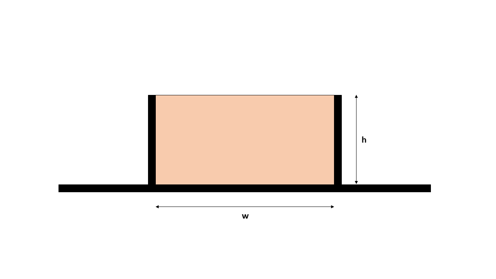
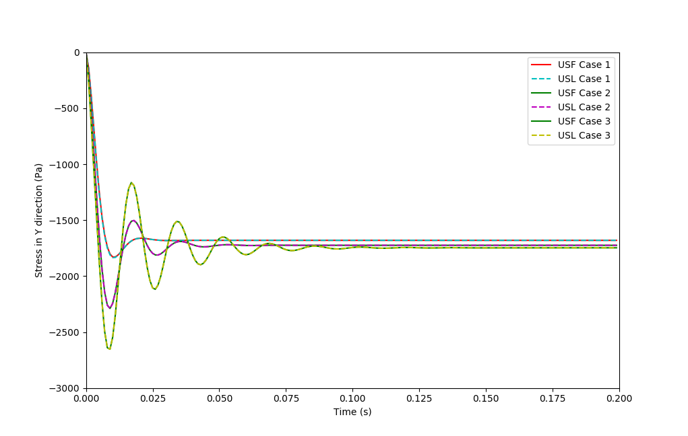
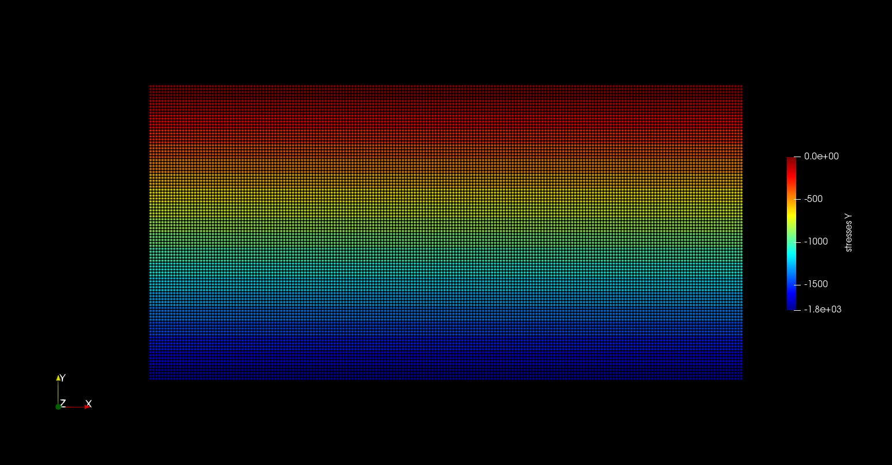

# Hydrostatic column

## Hydrostatic analytical solution

The hydrostatic validation involves applying gravity loading to a column of material restrained in both lateral components and along the bottom plane. The Newtonian fluid model will yield hydrostatic pressures for all normal stress directions ($\sigma_{xx}$, $\sigma_{yy}$, $\sigma_{zz}$). The linear elastic material will yield geo-static stresses in the vertical direction and the horizontal stresses depend on the Poisson's ratio.

> Hydrostatic column with a width `w` of 0.2 m and height `h` of 0.1 m. Restrained in both the lateral directions and along the bottom plane

## MPM configuration

### Mesh

|Cell dimensions	| Case 1    | Case 2     |  Case 3     |
|-------------------|--------- -|------------|-------------|
|x-length 		    | 0.01 $m$ 	| 0.005 $m$  | 0.0025 $m$  |
|y-length 		    | 0.01 $m$ 	| 0.005 $m$  | 0.0025 $m$  |

### Particles

|Particle spacings	| Case 1	 | Case 2	  |  Case 3    |
|-------------------|------------|------------|------------|
|x-spacing 		    | 0.002 $m$  | 0.001 $m$  | 0.0005 $m$ |
|y-spacing 		    | 0.002 $m$  | 0.001 $m$  | 0.0005 $m$ |
|Particles per cell |  25        |  25        |  25        |

### Analysis

|Description		    | Case 1		 | Case 2		  | Case 3		   |
|-----------------------|----------------|----------------|----------------|
|Total analysis time 	| 0.2 s		     | 0.2 s		  | 0.2 s		   |
|dt                     | 0.00001 s      | 0.000005 s     |0.0000025 s     |
|Gravity		        | -9.81 $m/s^2$	 | -9.81 $m/s^2$  | -9.81 $m/s^2$  |

### Material

|Description		     | value	     	|
|------------------------|------------------|
|Material	             | Newtonian        |
|Density ($\rho$) 		 | 1800.0 $kg/m^3$  |
|Bulk modulus ($K$)	     | 1000000 $N/m^2$	|
|Viscosity ($\mu$)       |  0.0             |

|Description		     | value	     	|
|------------------------|------------------|
|Material	             | Linear Elastic   |
|Density ($\rho$) 		 | 1800.0 $kg/m^3$  |
|Young's modulus ($E$)	 | 1000000 $N/m^2$	|
|Poisson's ratio ($\nu$) |  0.0             |

## Hydrostatic analysis

Analysis are carried out using MPM Explicit USF and USL algorithms using velocity update. Note that the results converge with more refined mesh with smaller errors.

## Results (Newtonian Fluid)

### USF results at t = 0.2s

| Parameter				| Analytical	| Case 1	| Case 2 	| Case 3 	|
|-----------------------|---------------|-----------|-----------|-----------|
|$\sigma_{yy} (N/m^2)$	| -1765.800		| -1680.244	| -1724.583 | -1746.791 |
|$\sigma_{xx} (N/m^2)$  | -1765.800 	| -1680.244	| -1724.583 | -1746.791 |

### USL results at t = 0.2s

| Parameter				| Analytical	| Case 1	| Case 2 	| Case 3 	|
|-----------------------|---------------|-----------|-----------|-----------|
|$\sigma_{yy} (N/m^2)$	| -1765.800		| -1680.182	| -1724.550 | -1746.774 |
|$\sigma_{xx} (N/m^2)$  | -1765.800 	| -1680.182	| -1724.550 | -1746.774 |

## Results (Linear Elastic)

### USF results at t = 0.2s

| Parameter				| Analytical 	| Case 1	| Case 2 	| Case 3 	|
|-----------------------|---------------|-----------|-----------|-----------|
|$\sigma_{yy} (N/m^2)$	| -1765.800	    | -1680.244	| -1724.583 | -1746.791 |
|$\sigma_{xx} (N/m^2)$  |     0.000	    |     0.000	|     0.000 |  0.000    |

### USL results at t = 0.2s

| Parameter				| Analytical 	| Case 1	| Case 2 	| Case 3 	|
|-----------------------|---------------|-----------|-----------|-----------|
|$\sigma_{yy} (N/m^2)$	| -1765.800		| -1680.182	| -1724.550 | -1746.774 |
|$\sigma_{xx} (N/m^2)$  |     0.000  	|     0.000	|     0.000 |  0.000    |

> Plot of vertical stresses with time showing convergence of stress osciallations

> Vertical stresses component results at t = 0.2s for USF linear elastic model

