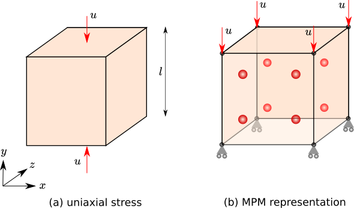

# Uniaxial stress

In an uniaxial stress state, only the axial stress is non-zero while all other stress
components are zero.

Under an axial loading condition, the strains for an isotropic linear elastic material are:

$$ \epsilon_{axial} = \frac{1}{E}(\sigma_{axial} - 2 \nu \sigma_{lateral})$$

$$ \epsilon_{lateral} = \frac{1}{E}\left[(1 - \nu)(\sigma_{lateral} - \nu \sigma_{axial} \right]$$

For an uniaxial stress ($\sigma_{lateral} = 0 $), the above equation becomes:

$$ \sigma_{axial} = E \epsilon_{axial} $$

$$ \epsilon_{lateral} = - \nu \epsilon_{axial} $$

## Analytical solution

Fo an axial loading condition, the axial strain and stress at a given time $t$ are:

$$ \epsilon_{yy} = u \times \frac{(t - t_0)}{l} $$

$$ \sigma_{yy} = E \epsilon_{yy} = E \times u \times \frac{(t - t_0)}{l} $$

and the lateral strains are:

$$ \epsilon_{xx} = \epsilon_{zz} = -\nu \times \epsilon_{yy} $$

where,

$u$ is the applied velocity at both ends,
$l$ is the length of the block, and
$E$ is the young's modulus of the system.

